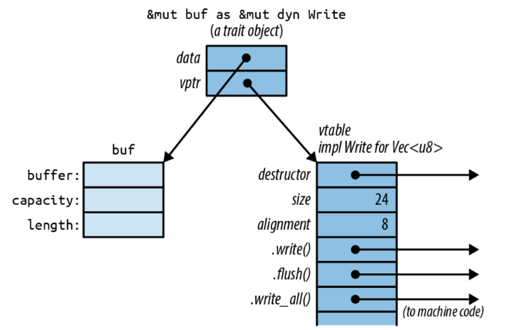

# trait：接口

万物皆可组合。  -- 知乎

Rust 通过两种特性来支持多态：trait和泛型。
trait 是 Rust 中的接口。泛型函数或者类型可以用于多种不同的类型。

泛型和trait紧密相关：泛型函数在约束中使用 trait 来表明它可以用于哪些类型的参数。

## trait的用法

trait 代表一种能力，类型可以做的事情。

> trait有一个特殊规则：trait自身必须在作用域里。简单说，trait必须显示导入。

有一些trait不需要导入，比如Clone 和 Iterator，是因为它们默认总是在作用域里，它们是标准 prelude 的一部分：Rust 会自动导入每个模块中的名称。事实上，prelude 就是一组 trait 的集合。

### trait对象

trait类型的引用，成为trait对象。和其他引用类似，一个trait对象指向某个值，它有生命周期，它可以是可变的或共享的。

trait对象的特殊之处在于：Rust在编译期通常不知道被引用值的类型是什么。

```rust
use std::io::Write;
use std::str;

// &mut dyn Write 表示实现了Write trait的值的可变引用
fn say_hello_dyn(out: &mut dyn Write) -> std::io::Result<()> {
    out.write_all(b"hello, world\n")?;
    out.flush()
}

#[test]
fn test_trait_with_dyn() {
    let mut bytes = vec![];

    // Rust允许进行普通引用到trait对象的转换。
    // let writer: &mut dyn Write = &mut bytes;
    say_hello_dyn(&mut bytes);
    println!("buf value: {:?}", str::from_utf8(&bytes).unwrap())
}
```

在内存中，一个trait对象是一个胖指针，由指向值的指针加上一个指向表示该值类型的函数表的指针组成。
因此，每个trait对象要占两个机器字。如图所示：


### 泛型函数

泛型函数在于指定类型参数，类型参数决定了泛型函数如何被调用。类型参数通常是大写字母。

``` rust
use std::io::Write;
use std::str;

fn say_hello<W: Write>(out: &mut W) -> std::io::Result<()> {
    out.write_all(b"hello, world\n")?;
    out.flush()
}

#[test]
fn test_trait() {
    let mut buf: Vec<u8> = vec![];
    // let writer: &mut dyn Write = &mut buf;
    say_hello(&mut buf);
    println!("buf value: {:?}", str::from_utf8(&buf));
}
```

where 语法可以用于泛型结构体、泛型枚举、类型别名以及方法——任何允许约束的地方。where语法可以避免泛型约束过长导致可读性较差的问题。

泛型和trait相比有三个优点：

+ 速度：泛型函数签名没用dyn关键字。因为在编译期指定里确定的类型，泛型不涉及动态分发。
+ 有的trait不支持trait对象
+ 可以很容易地给泛型类型参数添加多个trait约束。

## 定义和实现trait

定义一个 trait 很简单，只需要给出名字和 trait 方法的签名类型。

要实现一个 trait，需要使用语法 `impl TraitName for Type`。

Rust 允许你在任意类型上实现任意 trait，只要 trait 或者类型是在当前 crate 中定义的。

> 当你实现一个 tarit 时，trait 和类型至少有一个必须是在当前 crate 中新定义 的。这被称为孤儿规则(orphan rule)。它帮助确保 trait 的实现是唯一的。

trait 中可以将 `Self` 关键字用作类型。

子trait可以作为另一个 trait 的扩展。用户可以假定任何实现了子 trait 的值一定也实现了 它的父 trait。但在 Rust 中，一个子 trait 不会继承父 trait 中的相关 item，如果你想调用方法的 话仍然要确保每个 trait 都在作用域中。

``` rust
trait StringSet {
    /// 返回一个空的集合。类型关联函数（初始化函数、构造函数）
    fn new() -> Self;
    /// 查找集合是否包含`string`。
    fn contains(&self, string: &str) -> bool;
    /// 向集合中添加一个字符串。
    fn add(&mut self, string: &str);
}
```

## 定义类型关系的 trait

trait 可以用于需要多个类型协同工作的场景。它们可以描述类型之间的关系。

在trait中可以定义关联类型、关联常量。

impl trait 允许擦除返回值的类型，只指名他实现的trait，并且没有动态分发或对分配。

> Rust 不允许 trait 方法使用 impl trait 作为返回类型。

## 总结

trait与泛型是Rust中非常重要的两个概念，在闭包、迭代器、并发、输入/输出等一些通用的标准库中广泛使用。
